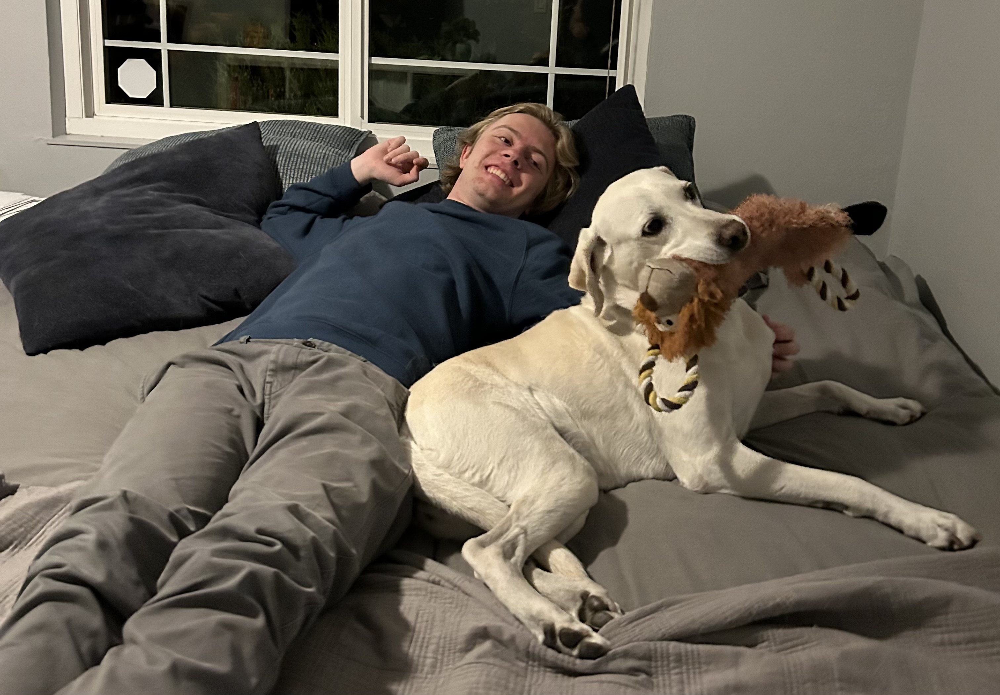
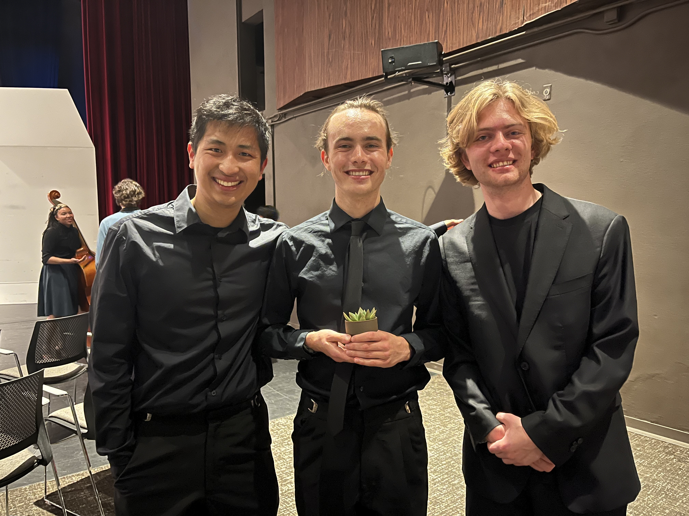
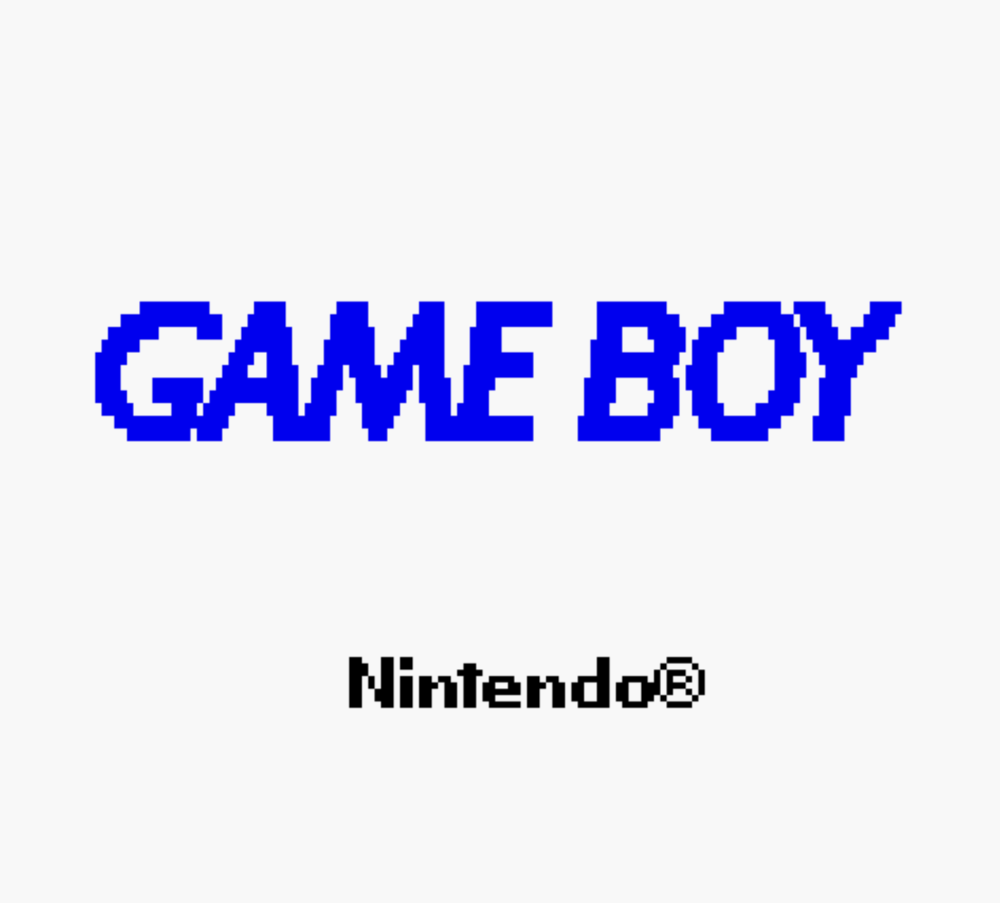
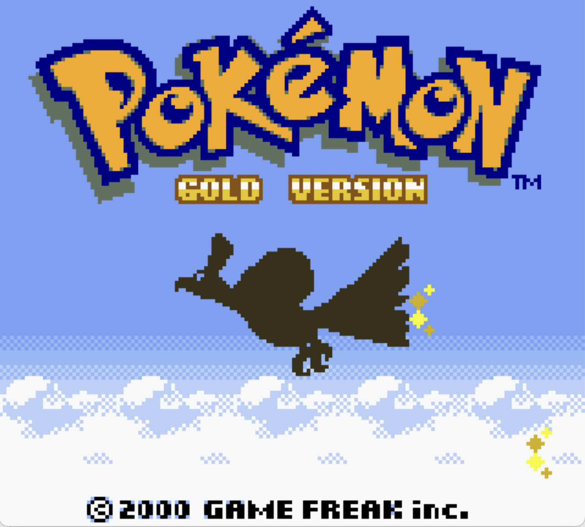
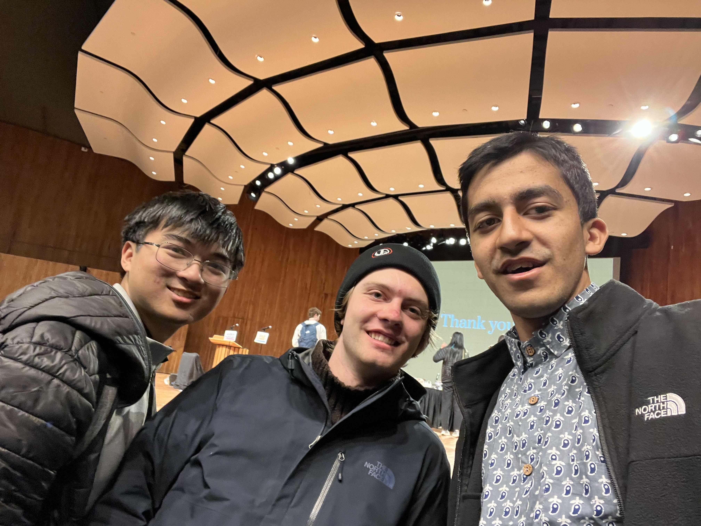
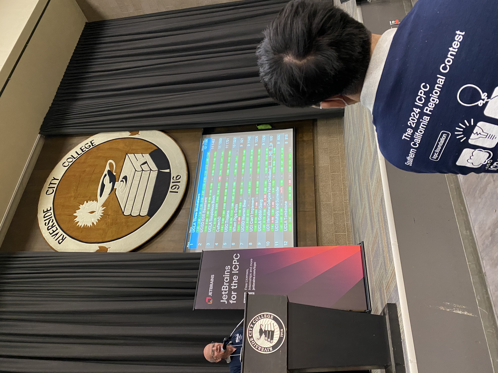

# User Page

Woah, look at this *super* awesome **USER PAGE**!! From the top, we've got:

1. [Who am I?](#who-am-i)
2. [What do I program?](#what-do-i-program)
3. [What do I hope to achieve in this class?](#what-do-i-hope-to-achieve-in-this-class)
4. [Lab 1 submission](#lab-1-submission), which is just where I put some links to the submission images :)

## Who am I?

Hi, I'm Hugo! (It's legally Carl, but really, I've never used that name in my life)

<!---
I know this isn't the typical way to do images in Markdown but I wanted the image to stay at a constant width
-->


> *Me and my wonderful dog, Stella*

I am a Computer Science (as I suspect we all are) and Applied Mathematics double major, and it's my second year here at UCSD.

I was originally born in Uppsala, Sweden and lived there until I was 11 years old. My family still speaks Swedish at home and we still have a summer house there, so I visit often.


> *Taken from my summer house in Sweden*

After that, my family moved to Menlo Park in the Bay Area. I was doubtful at first (as you imagine any 11-year-old might be when he moves halfway across the world), but I've grown to really love it here in California. 


> *Me and my family during Thanksgiving 2024*

In addition to coding and being a full-time college student, I also do some other things. I've played the trumpet since I was in third grade. I stopped playing at the end of the last school year because I didn't have the time and would rather spend it on doing other things, but I might pick it back up again when I'm less busy.



> *Me and my fellow trumpet players at the end of last year's concert*

I also play loads of games, though not as much as I used to back in highschool. Among my favorites are:

- Minecraft
- Hades
- Balatro
- Hollow Knight (by the way, as of the morning of writing this, Silksong has just been announced to release later this year, which is exciting!)
- Variant Sudoku (not really a game in particular but I still enjoy them)

Something that you probably wouldn't expect from me is that I also am part of a 4-year long game of DnD. We're currently on our second campaign!

## What do I program?

I've been programming since 5th grade, though I only started writing code with text seriously in high school (before that it was mostly block code). The code that I write varies largely, but it's usually made with a very specific purpose in mind.

Some of my favorite things I've made include...

### Catan

I made a game of Catan that runs in the terminal, which you can find [here](https://github.com/HugoIngelsson/Catan). I put a lot of effort into making it look good in the terminal using ANSI codes, which is harder said than done. I had to create my own rendering system and artwork (especially hard since the pixels aren't 1x1 but rather in a weird aspect ratio), and this is of course on top of all of the game logic and player inputs I had to program.

I think the coolest thing about this project to me is that it's all just in native Java, so pretty much any system that supports ANSI escape codes can run the app. Maybe I missed an opportunity to learn some other framework when making this instead, but I think it was a good chance to get into the meats of how to build something ground up.


> *The home screen for my game of Catan*

### Game Boy Emulator

At the end of last summer, I built a [Game Boy emulator](https://github.com/HugoIngelsson/GB_Emu) (which I then expanded to include Game Boy Color).

Ultimately, it boiled down to painstakingly reading through every detail on how the Game Boy works, which was pretty much only possible due to [PanDocs](https://gbdev.io/pandocs/). I implemented every OP-code, every quirk with the PPU (pixel-processing unit), every timing between PPU and CPU. Slowly but surely, I made it into a working machine, until it was finally done.

The feeling of seeing the startup screen work for the first time is like no other. It really is a special kind of magic to have worked so close to the computer-level functionality of a device and then have it function.



> *The startup screen for Game Boy Color running in my emulator*



> *The home screen for Pokemon Gold running in my emulator*

### AI

Yes, yes, I know AI gets a bunch of hype nowadays, but I've dabbled. 

#### Chess AI

One cool thing I made was as part of [Sebastian Lague's Chess Bot Challenge](https://www.youtube.com/watch?v=Ne40a5LkK6A), where, as the name suggests, I built a chess bot that then competed against other people's bots in a tournament. Ultimately, I placed 111th out of 624 competitors, which I think is decent enough since the competition was open to anyone who wanted to participate.

It did have a twist, however, which was that bots were restricted to the number of "tokens" they could contain, so you couldn't just up and copy Stockfish as your submission. In the context of software engineering, however, this led to a bunch of bad code; this is one of my favorite snippets from what I submitted:

```
ulong[,] packedTables = {
    {0x0358305008132370,0x02339AA00477FDB0}, // pawns middlegame
    {0x08BAA8727ADCCB92,0x8CFEECA7AEFFECB7}, // knights middlegame
    {0x1667886096ADACA8,0x699CD8C759AEFB95}, // bishops middlegame
    {0x493162304D958663,0x9EB88975CFDA8AB8}, // rooks middlegame
    {0x2014722629CF8980,0x5C9DBEA02AA8A9D7}, // queen middlegame
    {0x0112265D0011247F,0x0001146A00011248}, // king middlegame
    {0x0C8532000A843120,0x096432500FA54530}, // pawns endgame
    {0x035676401569B854,0x559CCA969CDFEEC9}, // knights endgame
    {0x2558884038DBAB95,0x4BC9CB847CDFFEC9}, // bishops endgame
    {0xE8943902686A6220,0xFF392551C4A39352}, // rooks endgame
    {0x04678531379AB973,0x58ADDA846ACFFCB7}, // queen endgame
    {0x1377874049DDCA83,0x59EFDDA66AEFDDA6}  // king endgame
};
```

A central strategy in building a chess bot is to evaluate each piece's value relative to where on the board it is. Doing this naively, as with a simple 8x8 2D array for each piece, takes up *way* too many tokens, however, so I needed to compress the info much further. That's where the above comes from: it's more efficient to store each value as a byte part of a long and then unpack the value every time you need it, at least from a token perspective.

#### Battlecode

This is a [competition](https://battlecode.org/) where you build an AI to play in a real-time strategy (RTS) game (much like Starcraft, if you've heard of it) hosted by MIT. Each agent in the game has its own brain which you must program, and whoever beats their opponent at achieving the objective wins the match. I've competed two years in a row with two of my friends, and this year we made it into the top 16 (winning us a free trip to Boston).

There are a couple of reasons why the competition is so challenging (and fun!). First, you only program the brains of individual robots, who are all part of a team, and there isn't a direct way for them to influence each others' actions. They thus have to operate on some kind of shared strategy. Furthermore, individual robots only have a limited sensing distance, so the small amount of messaging that robots do get has to be used to organize over the entire map. Finally, robots are restricted on how much bytecode (effectively computational power) they're allowed each round, meaning you not only have to manage actual in-game resources but also how efficiently the robots operate.



> *Me and my teammates in Boston after the final tournament*

### Competitive Programming

Since getting to college, I've also gotten into competitive programming. I joined the ICPC club at UCSD and have competed at the SoCal regional two years in a row now, placing 7th this last fall.

Really, competitive programming only gives a slice of what programming ought to be, and it does lend itself to some bad habits (like using nonsensical names for variables and macros to make code faster to write). However, I also think it's given me the perspective and ability to write code that is more efficient, which I think a valuable skill.



> *Image from this last year's competition season. I was on team "UCSD Warrent Bear"*

## What do I hope to achieve in this class?

Most of the coding I've done in my life has been relatively short-term, and even the things I've worked on for longer periods of time (like - and -) have been solo projects, so I could keep most of the info in my head while I was working on them. Thus, I think the thing I'd most like to gain from this class is the ability to work on a team to build a codebase that will last for more than a month and is easy to enter as an unfamiliar developer.

I think this is a pretty good summary of what I'd like for this quarter:

- [ ] Learn what it means to be a software engineer
- [ ] Work in a group to develop something useful/fun
- [ ] Create a codebase that is maintainable
- [ ] Learn how to use JavaScript
- [ ] \(Optional) Get 8 hours of sleep nightly

## Lab 1 submission

Of course, this entire page was part of the submission, but I've also included screenshots for using GitHub with [the command line](screenshots/command_line.png) and [VS Code](screenshots/VS_Code.png). You can also access the [.gitignore](.gitignore) and [README](README.md) files, ~~but not PRIVATE.txt cause that's for me only.~~